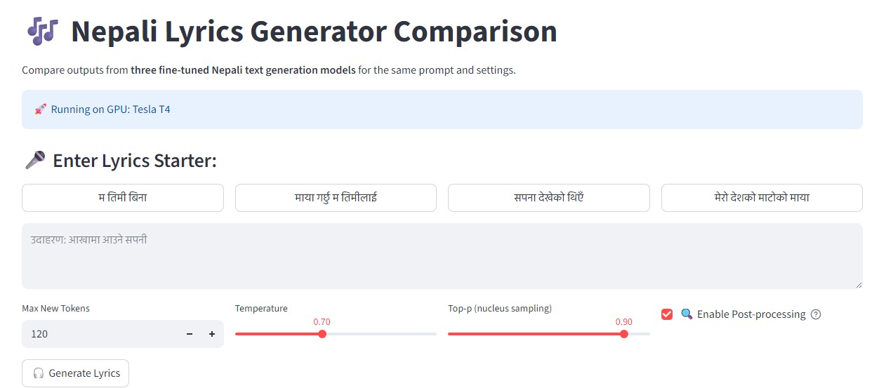
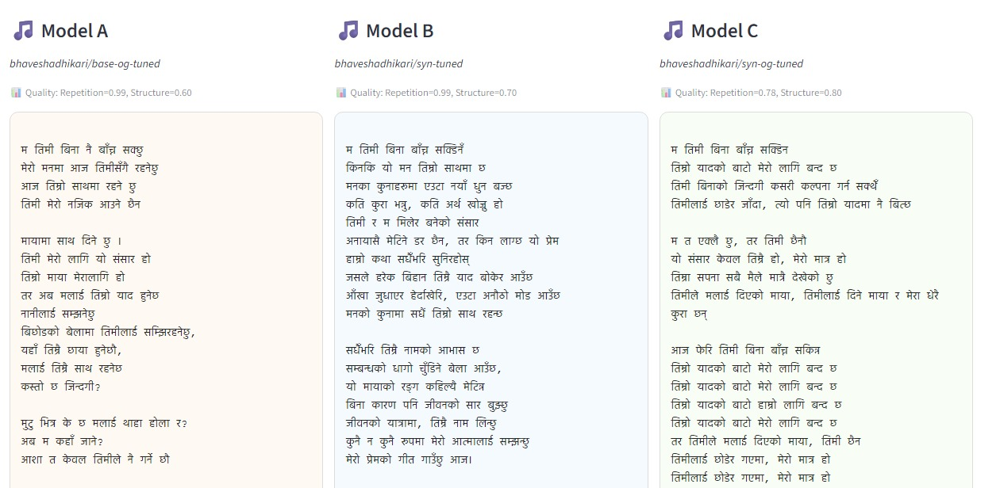
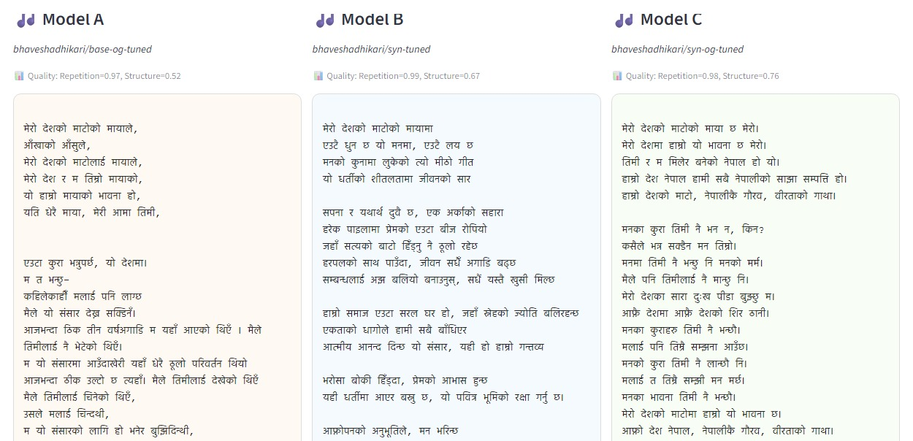

# Nepali Lyrics Generator 🎶

A Streamlit interface to compare generation quality across multiple models. ( These models are the results from a bachelor thesis that fine-tuned GPT-2 style models on Nepali lyrics )

Note: This repository doesnt contain the data collection, and preprocessing utilities. 

---

## Contents

- `app.py` — Streamlit app to compare outputs from multiple fine-tuned Nepali models.
- `train.ipynb` — Notebook used to fine-tune the models.
- `generation_playground.ipynb` — Interactive exploration & generation experiments.
- `interface/` — Static assets and screenshots used here

---

## Features

- Compare outputs from three fine-tuned models side-by-side
- Sampling controls: temperature, top-p, max tokens
- Optional post-processing to select the best sample by repetition and structure scores

---
## ☁️ Run in Colab

There is a Colab demo that launches the Streamlit app from a Colab session. Open the notebook and click "Run all" to start the app in the hosted environment:

[](https://colab.research.google.com/gist/bhaveshadhikari/b1aad05d76304b6eca061cae82c31d5a/streamlit-on-colab.ipynb)

Wait for the Colab output cell that gives you the public Playground URL and open it in a new tab.

---


## If in case you wanna run locally

1. Clone the repository

	```bash
	git clone <repo-url>
	cd "nepali lyrics generator"
	```

2. Install dependencies (preferably in a virtualenv)

	```bash
    pip install streamlit transformers torch numpy
	```

3. Run the Streamlit app locally

	```bash
	streamlit run app.py
	```

4. Open the browser URL printed by Streamlit

---

## Training

- Open `train.ipynb` to see the dataset preparation and fine-tuning steps.
- The notebooks use the Hugging Face Transformers library to fine-tune a GPT-2 compatible model on Nepali lyric data.

Notes:
- GPU is highly recommended for training and faster inference.
- Uncheck "enable post processing" at local environment as it requires more GPU usage.

---

## Visuals





